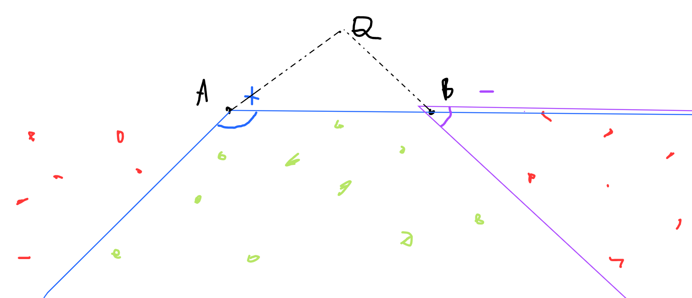

# Geometry


### Convex Hull
Fun facts:
- Set of points s.t. there exists a half-plane for each point that doesnt contain any other point
- If coordinates are `[0;C]`, there are at most `O(C^(2/3))` points inside the convex hull
  - https://codeforces.com/blog/entry/62183

### Try working the formulas instead of just using the geometry lib
For example, if you know that the points follow a formula and you are dealing the problem of checking if a line crosses these points, try working this on paper instead of jumping to the code. Use cross product and you may have now a number theory problem.

### Manhattan to Chebyshev distante
Chebyshev distance: `D(X,Y)=max(|X_i-Y_i|)`  
The Manhattan distance between points `X` and `Y` is "equivalent" to the Chebyshev distance between `X'` and `Y'`, where `P'` is the expansion of the abs for a point (all `2^(d-1)` combinations of signals. One coordinate can be fixed since we are taking the abs). Ex:
- `(x,y)` => `(x+y,x-y)`
- `(x,y,z)` => `(x+y+z,x+y-z,x-y+z,x-y-z)`  
Check: https://www.spoj.com/problems/DISTANCE/

### Place the largest non-overlapping polygon without touching other already placed
The optimal largest non-overlapping polygon will touch **at least two** that are already placed. If it touches less than two, it can be expanded.  
A special case is when figures are circles and lines. In this case, the places circle will touch at least three other figures (circle/line).
  
Check: https://codeforces.com/gym/101078/problem/E

### Getting through
Getting through a corridor where figures may block the passage if they intersect or touch each other.  
Can be solved using DSU for checking if parallel walls are connected, blocking the passage.  
  
The maximum circle that can go through without being blocked is bounded by one of the `n^2` distances.  
Testing if circle with radius `r` goes through: unite all pair of elements with distance `<= 2*r` in order to simulate a blockage.
Solve using binary search of simple brute force on all sorted distances.
  
Check: https://codeforces.com/gym/100625/problem/G

### Virtual images for reflection/bouncing
Some problems ask for you to reflect/bounce (angle in equals angle out) a line until it reaches a point or crosses some segments. 
For handling this complex operation, you can create virtual images of the original input. 
Now, a line that would be reflected can now just go through in these virtual images.  

For example, if we have a mirror in the bottom edge and a line is going at it, instead of reflecting, create a mirroed input at the bottom and just keep the line going in it.  
  
Every time a virtual image is created, it will be mirroed depending from which direction it is coming from. 
  
Check: https://codeforces.com/problemset/problem/241/C  
Check: https://codeforces.com/gym/101519/problem/F  

### Side of polygon
A polygon has every side smaller ~or equal~ to the sum of all other sides.

### 3 colinear points / Bad point between good points
For each (good) point `p`, do polar sort of all the points using `p` as center. If there are colinear points, they will be adjacent in this sorting (bad will be adjacent to good).

### Perimeter and area of convex polygons
- Given a fixed perimeter, approximating the polygon to a circle will maximize its area
- Given fixed edge lenghts, the area of a polygon determined by such edges will be maximized when inscribed on a circle
- Bretschneider's formula:
```
area_of_quadrilateral = sqrt((s-a)(s-b)(s-c)(s-d)-abcd*cos^2((â+ĉ)/2))
s: semiperimeter
â and ĉ: any opposite angles

- The quadrilateral can be both convex or concave, but it mustn't cross itself
- If `d=0`, this is a triangle (Heron's formula)
- A convex quadrilateral ABCD is cyclic iff its opposite angles are equal `180deg` => `cos(...) = 0` (Brahmagupta's formula)
```

### Helly's theorem (intersection between convex polygons)
Let `C` be a finite family of convex polygons in `R^n` such that, for `k ≤ n + 1`, any `k` members of `C` have a nonempty intersection. 
Then the intersection of all members of `C` is nonempty.
Eg.: In the plane (2d), if, for every triple (3) of convex polygons, there is a non-empty intersection, the intersention of all polygons is non-empty.

### Pick's theorem (area, integer points)
Let `P` be a polygon with integer coordinates for its vertices.
Let:
```
- A: Area of P
- i: #integer points inside the polygon
- b: #integer points in the polygon boundaries
Then, A = i + (b/2) - 1
```
### Range of points inside trapezoidal defined by segment `AB` and query point `Q`


Note that we can decompose the range into two prefixes if we keep points polar sorted using `A` and `B` as pivots in lists `X` and `Y` respectively.
  
The desired points are `prefix_i(X) - prefix_j(Y)`, `i` and `j` can be found by querying `BÂQ` angle in `X` and `A^BQ` angle in `Y`.
  
This is a special case of the "contribution" techinique in which we decompose a complex update into simpler ones and solve the final result at the end of all updates.
  
Check: https://codeforces.com/gym/103640/problem/A  

### Minkoviski sum
Definition: `A ^ B = {a + b | a \in A, b \in B}`

Properties:
- `A ^ NULL = A`
- `A ^ {v} = {a + v | a \in A} (translating)`
- `A ^ {0} = A`
- `A ^ B = B ^ A`
- `(A ^ B) ^ C = A ^ (B ^ C)`
- `c(A ^ B) = cA ^ cB (scaling)`
- `A /\ B != NULL` iff `0` is inside `A-B`.
  - If `0` lies on a (non-deg) vertice of `A-B`, `A /\ B` is a point
  - If `0` lies on an edge of `A-B`, `A /\ B` is a segment
  - If `0` lies on inside `A-B`, `A /\ B` is a polygon
  - `0` is inside `A-B` iff exists `a \in A` and `b \in B` s.t. `a = b <=> a - b = 0`. Since the image of `a - b` equals `A-B`, `0 \in A-B`.
- `argmin_v((A + {v}) /\ B = NULL) = argmin_v(0 \not_in A-B+{v})`

### Subset of vectors w/ sum w/ maximal sqrt norm
Observe the answer vector `V`. Only vectors `u` with `angle(V,u) <= 90degs` were used to build `V`.
If we sort the list of input vectors by angle (polar sort), the answer will be a subsegment of the final list in which the distance between the first and last vector does not exceed `90degs`. There may be a border case if `angle == 90`.
  
Check: https://atcoder.jp/contests/abc139/tasks/abc139_f
  
## Analysis

### General observations
- Avoid using floating points (division, square root, trigonometric functions); try to use fractions
- Avoid doing too much comparisons w/ floating points
- Avoid using floating points with big magnitude. This implies a greater error.

#### Catastrophic cancelletion
Assume that the relative error is `10^-6`. 
Lets say we cancel out `A=10^6` and `B=10^6`, their erros are `10^0`. `A-B` is now `10^0` with error `10^0`.
We don't want this to happen.

### Convex/Concave function
- A function is convex iff its derivative is monotonic non-decreasing. It has one minimal=minimum point.
- A function is concave iff its derivative is monotinic non-increasing. It has one maximal=maximum point.
- You can ternary search a convex/concave function  
- The linear combination of convex/concave functions is convex/concave
- Max/Min of convex/concave functions is also convex/concave
- Linear functions are both convex and concave
- `f(x)=|A-x|` is convex

Check: https://www.thehuxley.com/problem/615

#### Abstracting parameters can help
For example, finding the maximum segment sum on an array where we can do `a_i - x` for all `i` is described as:
```
max_x max_(i<j) sum_i_j a_i - x
```
But we can note that `max_(i<j) sum_i_j a_i - x` is a function decreasing on `x`. 
Abstracting `i` and `j` as inputs and only think of `f(x)`, that outputs this maximum value.  
We can now think of `f(x)` as a non-decreasing function, not analyzing the behaviour of variables `i` and `j`.
  
Check: https://codeforces.com/contest/1355/problem/E

### Absolute error and squared euclidean minimization
If in 1D, the median of `A`s minimizes the sum of `|x - A|` errors.
Also, the mean minimizes the sum of **squared** euclidian distances (`||x - A||^2`).

### Convex closures
(http://www.cs.cmu.edu/afs/cs/academic/class/15456-s10/ClassNotes/lecture2.pdf)  
A convex combination of a set of points is a linear combination that is both non-negative and affine i.e. a weighted sum of such points s.t. their coefficients sum up to 1 and all are >= 0.
- The convex closure of a point is the point itself. 
- The convex closure of two points is the line segment between them. 
- The convex closure of a set of points in the plane is a convex polygon.
With this, we know that a point is inside a polygon iff it can be represented as a convex combination of some of its vectors (which can be the polygon's vertixes).
Also, a polygon can be seen as an infinite set of vectors.

